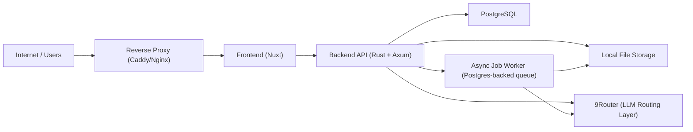

# Laporin Architecture Overview

## System Context Diagram


## Design Principles
- **Modular Monolith** – Single Axum binary codebase with explicit bounded context modules.
- **Provider Abstractions** – CAPTCHA, LLM, search crawling, and payment drivers implemented behind Rust `trait`s.
- **Resource-Conscious** – Designed specifically for 2 GB RAM / 16 GB storage VPS constraints; PostgreSQL-backed job queue without Redis/Kafka.
- **Security-First** – Zero-trust handling of external web content, SSRF filtering, prompt sanitization, signed webhook verification, and HttpOnly/Secure cookies.

## Core Bounded Contexts
| Context | Owner | Responsibilities |
|---------|-------|------------------|
| Auth | Backend | Email/password (Argon2id), Google OAuth, hCAPTCHA, OTP, session management |
| Report | Backend | Domain model, lifecycle state machine, CRUD, entitlement |
| Research | Backend | 9Router abstraction, web crawling, provenance tracking |
| Generation | Backend | DOCX rendering, preview (PDF via headless LibreOffice), job orchestration |
| Payment | Backend | Mayar integration, HMAC-SHA256 webhook handling, backend-only entitlement |
| Frontend UI | Frontend | UI flows, state management, PDF preview viewer, API consumption |

## Report Status Enum (Canonical)
The following 12 statuses are strictly canonical across OpenAPI, DB schema, backend domain types, and frontend state machines:
```
draft
researching
research_completed
generating
generated
preview_ready
payment_pending
paid
unlocked
failed
cancelled
expired
```
All values are lower-case, snake_case, and stored identically across all contracts.

## Resource Limits (2 GB RAM / 16 GB Storage)
- **Concurrent AI research jobs**: 2
- **Concurrent document rendering jobs**: 1
- **Max research sources per project**: 5
- **Job timeouts**: 10 min (research), 5 min (generation)
- **Temporary file retention**: ≤ 30 min
- **Final DOCX retention**: 30 days post-unlock
- **Memory safety threshold**: RAM < 500 MiB pauses worker job intake
- **Disk safety threshold**: Disk < 1 GB free pauses job intake and rejects new reports

## Documentation Index & Contracts
- [OpenAPI Specification](file:///home/avrjulian/.gemini/antigravity-cli/brain/b002fd7f-91a4-494f-9435-5b5c7731d90d/docs/openapi.yaml)
- [Database Schema](file:///home/avrjulian/.gemini/antigravity-cli/brain/b002fd7f-91a4-494f-9435-5b5c7731d90d/docs/database-schema.md)
- [Canonical Report Schema](file:///home/avrjulian/.gemini/antigravity-cli/brain/b002fd7f-91a4-494f-9435-5b5c7731d90d/docs/report-schema.md)
- [Security Contract](file:///home/avrjulian/.gemini/antigravity-cli/brain/b002fd7f-91a4-494f-9435-5b5c7731d90d/docs/security.md)
- [Payment & Entitlement Flow](file:///home/avrjulian/.gemini/antigravity-cli/brain/b002fd7f-91a4-494f-9435-5b5c7731d90d/docs/payment-flow.md)
- [Research Job Flow & Provenance](file:///home/avrjulian/.gemini/antigravity-cli/brain/b002fd7f-91a4-494f-9435-5b5c7731d90d/docs/research-flow.md)
- [Preview Generation & Delivery](file:///home/avrjulian/.gemini/antigravity-cli/brain/b002fd7f-91a4-494f-9435-5b5c7731d90d/docs/preview-flow.md)
- [Async Job Queue Contract](file:///home/avrjulian/.gemini/antigravity-cli/brain/b002fd7f-91a4-494f-9435-5b5c7731d90d/docs/jobs.md)
- [Storage Layout & Lifecycle](file:///home/avrjulian/.gemini/antigravity-cli/brain/b002fd7f-91a4-494f-9435-5b5c7731d90d/docs/storage.md)
- [Rate Limiting Policy](file:///home/avrjulian/.gemini/antigravity-cli/brain/b002fd7f-91a4-494f-9435-5b5c7731d90d/docs/rate-limiting.md)
- [Template Placeholder Mapping](file:///home/avrjulian/.gemini/antigravity-cli/brain/b002fd7f-91a4-494f-9435-5b5c7731d90d/docs/template-placeholders.md)

## Architecture Decision Records (ADRs)
- [ADR-001: Modular Monolith Architecture](file:///home/avrjulian/.gemini/antigravity-cli/brain/b002fd7f-91a4-494f-9435-5b5c7731d90d/docs/architecture-decisions/ADR-001-modular-monolith.md)
- [ADR-002: Backend-Authoritative Payment & Entitlement](file:///home/avrjulian/.gemini/antigravity-cli/brain/b002fd7f-91a4-494f-9435-5b5c7731d90d/docs/architecture-decisions/ADR-002-payment-flow.md)
- [ADR-003: Research Fact Provenance Tracking](file:///home/avrjulian/.gemini/antigravity-cli/brain/b002fd7f-91a4-494f-9435-5b5c7731d90d/docs/architecture-decisions/ADR-003-research-provenance.md)
- [ADR-004: Direct Backend PDF Preview Delivery Strategy](file:///home/avrjulian/.gemini/antigravity-cli/brain/b002fd7f-91a4-494f-9435-5b5c7731d90d/docs/architecture-decisions/ADR-004-preview-strategy.md)
- [ADR-005: PostgreSQL-Backed In-Process Job Queue](file:///home/avrjulian/.gemini/antigravity-cli/brain/b002fd7f-91a4-494f-9435-5b5c7731d90d/docs/architecture-decisions/ADR-005-job-queue-design.md)
- [ADR-006: Local Filesystem Storage Layout & Security](file:///home/avrjulian/.gemini/antigravity-cli/brain/b002fd7f-91a4-494f-9435-5b5c7731d90d/docs/architecture-decisions/ADR-006-storage-layout.md)
- [ADR-007: Security, Authentication, and Threat Mitigation Policy](file:///home/avrjulian/.gemini/antigravity-cli/brain/b002fd7f-91a4-494f-9435-5b5c7731d90d/docs/architecture-decisions/ADR-007-security-policy.md)
- [ADR-008: 9Router Abstraction and Configurable LLM Routing](file:///home/avrjulian/.gemini/antigravity-cli/brain/b002fd7f-91a4-494f-9435-5b5c7731d90d/docs/architecture-decisions/ADR-008-llm-routing-9router.md)
