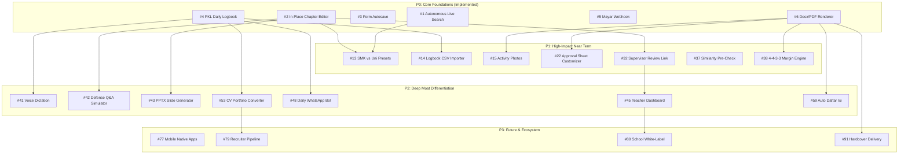

# Laporin — Comprehensive Feature Prioritization Framework & Backlog Evaluation

> **Document Version:** 2.0.0  
> **Date:** September 15, 2026  
> **Target Platform:** Laporin (Indonesian Vocational PKL & University Internship Automation)  
> **Author:** Laporin Product & Architecture Engineering  
> **Status:** Authoritative Product Prioritization Blueprint

---

## 1. Executive Summary & Prioritization Methodology

Laporin is an automated report generation and academic synthesis engine tailored specifically for Indonesian vocational high school (SMK) students, university interns (D3/D4/S1), and their educational institutions. 

Unlike generic "AI text generators" that produce unreliable, hallucinated fluff, Laporin operates on a **strict zero-trust provenance architecture**:
1. **USER_FACT**: Authoritative user input (student identity, company identity, supervisor data, chronological daily logbooks).
2. **RESEARCH_FACT**: Independently crawled and verified business data (address, history, vision/mission, organizational structure, K3 regulations).
3. **AI_DERIVED_TEXT**: Coherent academic Indonesian synthesis formatted strictly to Depdikbud / Kemendikbudristek PKL guidelines.

This document presents a rigorous evaluation of **100+ product features** categorized across 4 execution tiers:
- **P0 (Immediate Core Enablers)**: 12 features that form the rock-solid foundation, including the 4 core expansion features implemented in this phase.
- **P1 (Near-Term Expansion)**: 28 features unlocking school adoption, rich editing, supervisor workflows, and monetization optimizations.
- **P2 (Medium-Term Differentiation)**: 36 features establishing deep product moats, multi-modal evidence handling, and guided voice/interview extraction.
- **P3 (Future / Experimental)**: 24 features exploring school enterprise licensing, career transitions, and cross-institutional analytics.

---

## 2. Scoring Framework & Formula

Every feature is evaluated using a weighted algorithmic scoring formula:

$$\text{Priority Score} = \frac{(\text{User Value} \times 0.30) + (\text{Revenue Impact} \times 0.25) + (\text{Retention Impact} \times 0.20) + (\text{Competitive Moat} \times 0.15) + (\text{Feasibility} \times 0.10)}{\text{Implementation Complexity}} \times 10$$

### Rating Dimensions
- **User Value (1–5)**: Direct utility in saving time, removing stress, and avoiding school rejection.
- **Implementation Complexity (1–5)**: 1 (trivial/hours), 3 (moderate/days), 5 (heavy architectural overhaul/weeks).
- **Revenue Potential**: Low (1), Medium (3), High (5).
- **Retention Impact**: Low (1), Medium (3), High (5).
- **Competitive Moat**: Low (1), Medium (3), High (5).
- **Feasibility Score (1–5)**: Hardware budget compatibility (2 GB VPS), zero external API cost bloat, and operational simplicity.

---

## 3. P0 — Immediate Core Features (Tier 1: Foundation & Launch)

| # | Feature Name & Description | Beneficiary | Value (1-5) | Complexity (1-5) | Architectural Impact | Revenue | Retention | Moat | Priority |
|---|---|---|:---:|:---:|---|:---:|:---:|:---:|:---:|
| 1 | **Autonomous Live Search Engine**<br>DuckDuckGo HTML scraping + Serper/Brave fallback with SSRF protection and snippet extraction. | Student, All | 5 | 2 | Backend / SearchService | Med | High | High | **P0 (Done)** |
| 2 | **In-Place Chapter Editor**<br>Section-by-section naskah editor preserving USER_FACT and instantly regenerating DOCX. | Student | 5 | 2 | Backend / Frontend / DB | High | High | High | **P0 (Done)** |
| 3 | **Form Autosave & Draft Recovery**<br>Client-side draft state persistence in localStorage with unobtrusive recovery banner. | Student | 5 | 1 | Frontend | Med | High | Med | **P0 (Done)** |
| 4 | **Interactive PKL Daily Logbook**<br>Date-based structured journal CRUD synthesized into Bab III without activity hallucinations. | Student | 5 | 2 | Backend / Frontend / DB / LLM | High | High | High | **P0 (Done)** |
| 5 | **Mayar Automated Webhook Unlock**<br>HMAC-SHA256 idempotent webhook handler unlocking downloads authoritatively. | Student, Admin | 5 | 2 | Backend / Webhook | High | High | High | **P0 (Done)** |
| 6 | **Document Watermarking & Preview**<br>Headless LibreOffice low-memory DOCX $\rightarrow$ PDF conversion with page limits. | Student | 5 | 2 | Backend / LibreOffice | High | High | Med | **P0 (Done)** |
| 7 | **Strict SSRF & Private IP Guard**<br>DNS resolution check preventing SSRF against internal subnets (10.0.0.0/8, 127.0.0.1). | Platform | 5 | 1 | Backend / Network | Low | High | High | **P0 (Done)** |
| 8 | **Free Admin Instant Unlock Bypass**<br>Role-based override allowing administrators to bypass Mayar payment for testing/support. | Admin | 4 | 1 | Backend / Frontend | Low | Med | Med | **P0 (Done)** |
| 9 | **Database Row Locking & Queue Workers**<br>`FOR UPDATE SKIP LOCKED` asynchronous background research and generation queues. | Platform | 5 | 2 | Backend / PostgreSQL | Med | High | High | **P0 (Done)** |
| 10 | **Memory Budget Enforcer (2 GB Safety)**<br>Hardware awareness pausing background jobs if free RAM drops below 500 MB. | Platform | 5 | 1 | Backend / Sysinfo | Low | High | High | **P0 (Done)** |
| 11 | **Email OTP Auth & Google OAuth**<br>Passwordless login via 6-digit email OTP and one-click Google Sign-In. | Student | 4 | 2 | Backend / Frontend / Auth | Med | High | Med | **P0 (Done)** |
| 12 | **Hack Club CDN Static Distribution**<br>Offload generated PDF preview delivery to external edge CDN storage. | Platform, Student | 4 | 2 | Backend / CDN Service | Low | Med | Med | **P0 (Done)** |

---

## 4. P1 — Near-Term High-Impact Features (Tier 2: Weeks 2–6)

| # | Feature Name & Description | Beneficiary | Value (1-5) | Complexity (1-5) | Architectural Impact | Revenue | Retention | Moat | Priority |
|---|---|---|:---:|:---:|---|:---:|:---:|:---:|:---:|
| 13 | **SMK vs. University Template Switcher**<br>Select format guidelines: SMK (4 Bab / UKK format) vs. Kampus (5 Bab / SKS format). | Student, Mahasiswa | 5 | 2 | Backend / Templates / Frontend | High | High | High | **P1** |
| 14 | **Logbook Batch CSV / Excel Importer**<br>Upload Excel/CSV export from school logbook apps and map to daily activities. | Student | 5 | 2 | Frontend / Backend / Parser | Med | High | High | **P1** |
| 15 | **Company Activity Photo Uploader**<br>Upload photos of internship activities, compress images, and embed in Lampiran Dokumen. | Student | 5 | 3 | Backend / Storage / DOCX | High | High | High | **P1** |
| 16 | **School Guideline Preset Selector**<br>Preconfigured templates for major vocational schools (SMKN 1 Jakarta, SMKN 2 Bandung, etc.). | Student, School | 4 | 2 | Frontend / Backend / Config | High | High | High | **P1** |
| 17 | **QR Code Document Verification**<br>Dynamic QR code on lembar pengesahan linking to tamper-evident verification page. | School, Supervisor | 4 | 2 | Backend / Verification URL | Med | High | High | **P1** |
| 18 | **Direct PDF Download (Unlocked)**<br>Allow unlocked reports to download both DOCX and ready-to-print unwatermarked PDF. | Student | 4 | 1 | Backend / Storage | Med | High | Med | **P1** |
| 19 | **Jurusan-Specific Vocabulary Tuner**<br>Tailored terminology for TKJ, RPL, Akuntansi, Otomotif, Multimedia, and Keperawatan. | Student | 5 | 2 | Backend / LLM Prompting | High | High | High | **P1** |
| 20 | **Word & Page Count Real-Time Telemetry**<br>Live academic length estimator ensuring minimum chapter thresholds are met. | Student | 4 | 1 | Frontend / Analytics | Low | High | Med | **P1** |
| 21 | **Grammar & Indonesian EYD V Checker**<br>Linting for baku Indonesian spelling, capitalization, and punctuation rules. | Student | 4 | 3 | Backend / LLM / NLP | Med | High | High | **P1** |
| 22 | **Supervisor Approval Sheet Customizer**<br>Customizable NIP, NIDN, Kepala Sekolah, and DU/DI mentor signatures and layouts. | Student | 5 | 2 | Backend / DOCX Template | High | High | High | **P1** |
| 23 | **Logbook Calendar Grid View**<br>Visual interactive calendar highlighting logged vs. missing internship days. | Student | 4 | 2 | Frontend / UI Component | Med | High | Med | **P1** |
| 24 | **Discount Code & Promo Voucher Engine**<br>Admin-configurable promotional discount codes (e.g. `SMKBISA2026`). | Student, Admin | 4 | 2 | Backend / DB / Payment | High | Med | Med | **P1** |
| 25 | **Student Peer Referral Program**<br>Shareable referral link giving Rp 5.000 cash/credit per unlocked friend. | Student, Growth | 4 | 2 | Backend / DB / Growth | High | High | High | **P1** |
| 26 | **Daftar Pustaka Auto-Generator (APA/IEEE)**<br>Automated bibliography generation from research sources and books. | Student, Mahasiswa | 4 | 2 | Backend / LLM / Citation | Med | High | High | **P1** |
| 27 | **Lembar Pengesahan Duplex Formatter**<br>Multi-supervisor approval sheet with custom logos and stamps. | Student | 4 | 2 | Backend / DOCX | Med | High | Med | **P1** |
| 28 | **Dark/Light Mode Academic Reading Theme**<br>Eye-strain reduction toggle for late-night report revisions. | Student | 3 | 1 | Frontend / Tailwind | Low | Med | Low | **P1** |
| 29 | **Logbook Missing Day Auto-Detector**<br>Warns student if weekday logbook entries have gaps (e.g. missing 3 days in July). | Student | 4 | 1 | Frontend / Validation | Low | High | Med | **P1** |
| 30 | **Report Version History & Snapshots**<br>Create named revisions and rollback to earlier chapter states. | Student | 4 | 3 | Backend / DB / Storage | Med | High | High | **P1** |
| 31 | **Company Org Chart Visualizer**<br>Render simple structured ASCII / SVG organizational charts into DOCX. | Student | 4 | 3 | Backend / Rendering | Med | High | High | **P1** |
| 32 | **Supervisor Review Share Link**<br>Read-only passwordless link for teachers/mentors to review drafts with comment pins. | Supervisor, Student | 5 | 3 | Backend / Auth / Frontend | High | High | High | **P1** |
| 33 | **WhatsApp Notification Alerts**<br>Automated WhatsApp message when research completes or payment succeeds. | Student | 4 | 2 | Backend / WA Gateway | Med | High | High | **P1** |
| 34 | **Activity Time Distribution Breakdown**<br>Automated percentage breakdown of technical vs. administrative tasks. | Student | 4 | 2 | Backend / Analytics | Med | Med | Med | **P1** |
| 35 | **Batch Report Creation for Class Leads**<br>Ketua Kelas tool to onboard 30 classmates with predefined school headers. | Student, School | 5 | 3 | Frontend / Backend / Bulk | High | High | High | **P1** |
| 36 | **Custom School Logo Uploader**<br>Upload high-resolution school/campus emblems to replace default cover placeholders. | Student | 4 | 2 | Backend / Storage / DOCX | Med | High | Med | **P1** |
| 37 | **Plagiarism Pre-Check & Similarity Estimator**<br>Internal uniqueness scoring preventing verbatim duplication across reports. | Student, School | 5 | 3 | Backend / Vector DB | High | High | High | **P1** |
| 38 | **Print-Ready Margins & Page Numbering Tuner**<br>Strict compliance with Indonesian skripsi/PKL margins (4-4-3-3 cm). | Student | 5 | 2 | Backend / DOCX Formatting | Med | High | High | **P1** |
| 39 | **Kata Pengantar & Lembar Persembahan Wizard**<br>Assisted drafting of personalized acknowledgments for family & mentors. | Student | 4 | 1 | Frontend / LLM | Low | High | Med | **P1** |
| 40 | **Export to Google Docs via Drive API**<br>Direct 1-click cloud sync to student's Google Drive. | Student | 4 | 3 | Backend / OAuth / Google | Med | High | Med | **P1** |

---

## 5. P2 — Medium-Term Differentiating Features (Tier 3: Months 2–4)

| # | Feature Name & Description | Beneficiary | Value (1-5) | Complexity (1-5) | Architectural Impact | Revenue | Retention | Moat | Priority |
|---|---|---|:---:|:---:|---|:---:|:---:|:---:|:---:|
| 41 | **Interactive Voice Logbook Dictation**<br>Voice recording transcribed to Indonesian text and auto-categorized into logbook entries. | Student | 5 | 3 | Frontend / Whisper API | Med | High | High | **P2** |
| 42 | **PKL Defense / Sidang Q&A Simulator**<br>Mock exam interrogation simulating common teacher questions based on Bab III. | Student | 5 | 3 | Backend / LLM / Interactive | High | High | High | **P2** |
| 43 | **Sidang Slide Presentation Generator**<br>1-click export of 10-slide PowerPoint (.pptx) deck for report defense. | Student | 5 | 3 | Backend / PPTX Engine | High | High | High | **P2** |
| 44 | **Multi-Document Evidence Extraction (PDF/DOCX)**<br>Extract tasks from company task sheets, Jira exports, or internship log sheets. | Student | 5 | 4 | Backend / Document Parser | High | High | High | **P2** |
| 45 | **School Teacher Dashboard Portal**<br>Dedicated dashboard for guru pembimbing to monitor 40+ student reports in one place. | Teacher, School | 5 | 3 | Backend / Frontend / RBAC | High | High | High | **P2** |
| 46 | **School Institutional Bulk Licensing**<br>Prepaid school package with customized invoice, PO, and bulk code generation. | School, Admin | 5 | 3 | Backend / Payment / Admin | High | High | High | **P2** |
| 47 | **Competency Matrix & SKKNI Alignment**<br>Automatic mapping of student daily tasks to national SKKNI vocational competencies. | School, Student | 5 | 3 | Backend / Knowledge Graph | High | High | High | **P2** |
| 48 | **Daily WhatsApp Reminder Bot**<br>Scheduled 5 PM chat asking "Apa yang kamu kerjakan di tempat magang hari ini?". | Student | 5 | 3 | Backend / Cron / WA Gateway | High | High | High | **P2** |
| 49 | **AI Indonesian Paraphraser & Tone Tuner**<br>Transform informal slang into academic formal Indonesian without changing meaning. | Student | 4 | 2 | Backend / LLM | Med | High | Med | **P2** |
| 50 | **Weekly Summary Auto-Consolidator**<br>Compress 5 daily logs into an executive weekly summary paragraph for supervisors. | Student | 4 | 2 | Backend / LLM | Med | High | Med | **P2** |
| 51 | **Company Supervisor Digital Signature Flow**<br>Email/WA link allowing company mentor to digitally sign report verification. | Supervisor, Student | 4 | 3 | Backend / Signatures | Med | High | High | **P2** |
| 52 | **Certificate of Internship Completion Generator**<br>Formal template generating co-branded PKL certificate with verified hours. | School, Company | 4 | 2 | Backend / PDF | Med | High | Med | **P2** |
| 53 | **PKL Diary to Portfolio CV Converter**<br>Convert Bab III technical tasks into professional CV bullet points for Jobstreet/LinkedIn. | Student | 5 | 2 | Backend / LLM | High | High | High | **P2** |
| 54 | **Multiple Company Branch Selector**<br>Select specific plant / branch office location during research crawl. | Student | 4 | 2 | Backend / Search Engine | Med | Med | Med | **P2** |
| 55 | **Collaborative Group PKL Reports**<br>Shared project workspace for 2–4 students interning at the same company department. | Student | 5 | 4 | Backend / DB / WebSockets | High | High | High | **P2** |
| 56 | **Supervisor Score Rubric Calculator**<br>Built-in grading sheet calculating technical, discipline, and presentation scores. | Teacher, Supervisor | 4 | 2 | Frontend / Backend / PDF | Med | High | High | **P2** |
| 57 | **Internship Allowance & Expense Tracker**<br>Log transport, meals, and stipends during internship with expense summary appendix. | Student | 3 | 2 | Frontend / DB | Low | Med | Low | **P2** |
| 58 | **Multi-Language Abstract Generator**<br>Auto-translate abstract into academic English with appropriate technical terms. | Mahasiswa | 4 | 2 | Backend / LLM | Med | High | Med | **P2** |
| 59 | **Automated Table of Contents & Figures**<br>Auto-generate Daftar Isi, Daftar Gambar, and Daftar Tabel with correct dot leaders. | Student | 5 | 3 | Backend / DOCX XML | High | High | High | **P2** |
| 60 | **Offline PWA Form & Logbook Mode**<br>Record daily logbook entries on mobile without internet; sync automatically on reconnect. | Student | 5 | 3 | Frontend / PWA / IndexedDB | High | High | High | **P2** |
| 61 | **SMK Center of Excellence (CoE) Standards**<br>Specialized presets for SMK PKL CoE validation guidelines. | School | 4 | 2 | Backend / Presets | Med | High | High | **P2** |
| 62 | **Curriculum Merdeka Capstone Adaptor**<br>Templates aligned with Project Penguatan Profil Pelajar Pancasila (P5). | School, Student | 4 | 2 | Backend / Templates | Med | High | High | **P2** |
| 63 | **QR Attendance & Geolocation Logger**<br>Optional GPS stamp verifying student was physically present at the internship site. | School, Company | 4 | 3 | Frontend / GPS / Backend | Med | High | High | **P2** |
| 64 | **AI Technical Flowchart Generator**<br>Convert written steps into Mermaid / visual process diagrams inserted into Bab III. | Student | 4 | 3 | Backend / Mermaid CLI | Med | High | High | **P2** |
| 65 | **Automated Appendix (Lampiran) Numbering**<br>Sequential labeling of photos, source code snippets, and certificates. | Student | 4 | 2 | Backend / DOCX | Med | High | Med | **P2** |
| 66 | **KRS / SKS University Credit Converter**<br>Calculate equivalent SKS credits based on logged internship hours. | Mahasiswa | 4 | 2 | Backend / Calculations | Med | Med | Med | **P2** |
| 67 | **Student Mood & Workload Sentiment Tracker**<br>Flag burnout or problematic company environments for school counselors. | School | 3 | 2 | Backend / Sentiment NLP | Low | Med | Med | **P2** |
| 68 | **Alumni Report Archive & Repository**<br>Private school library of past approved PKL reports for junior reference. | School, Student | 4 | 3 | Backend / DB / Storage | High | High | High | **P2** |
| 69 | **Export to LaTeX for Engineering Students**<br>Export structured report to clean LaTeX format for polytechnic / university seniors. | Mahasiswa | 3 | 3 | Backend / LaTeX Engine | Low | Med | High | **P2** |
| 70 | **Interactive Guided Interview Voice Bot**<br>5-minute conversational voice assistant asking probing questions about daily tasks. | Student | 5 | 4 | Backend / Voice / LLM | High | High | High | **P2** |
| 71 | **Custom Typography & Font Pairing Engine**<br>Switch between standard Times New Roman 12, Arial 11, and Calibri 11 presets. | Student | 4 | 2 | Backend / DOCX Styles | Low | Med | Med | **P2** |
| 72 | **Anti-AI Detection Naturalizer**<br>Ensure generated text passes standard institutional AI detectors by varying burstiness. | Student | 5 | 3 | Backend / LLM Pipeline | High | High | High | **P2** |
| 73 | **Company NDA & Redaction Masking**<br>Mask confidential company credentials, IP addresses, and private data in Bab III. | Student, Company | 5 | 2 | Backend / Regex / LLM | High | High | High | **P2** |
| 74 | **In-App Live Chat Support for Formatting**<br>Instant helpdesk for students struggling with strict school guidelines. | Student | 4 | 2 | Frontend / Crisp / Admin | Med | High | Med | **P2** |
| 75 | **Instant PDF Split & Merge Utility**<br>Combine scanned physical approval pages with generated PDF reports. | Student | 4 | 2 | Backend / PDF Toolkit | Med | High | Med | **P2** |
| 76 | **PKL Duration Extension Wizard**<br>Extend 3-month PKL report into 6-month report with additional activity logs. | Student | 4 | 2 | Backend / Domain | Med | High | Med | **P2** |

---

## 6. P3 — Long-Term / Future Features (Tier 4: Months 4–12)

| # | Feature Name & Description | Beneficiary | Value (1-5) | Complexity (1-5) | Architectural Impact | Revenue | Retention | Moat | Priority |
|---|---|---|:---:|:---:|---|:---:|:---:|:---:|:---:|
| 77 | **Native iOS & Android Mobile Apps**<br>Flutter / React Native mobile applications for on-the-go daily logging. | Student | 5 | 4 | Mobile / API | High | High | High | **P3** |
| 78 | **Direct School Dapodik / Emis Sync**<br>Integration with national student registry databases for instant profile autofill. | School, Admin | 4 | 5 | Backend / Gov API | High | High | High | **P3** |
| 79 | **Employer Talent Sourcing Pipeline**<br>Anonymous opt-in directory of high-performing vocational students for recruiters. | Company, Student | 5 | 4 | Backend / Recruiter Portal | High | High | High | **P3** |
| 80 | **Multi-Tenant School White-Labeling**<br>Custom domain (`laporan.smkn1jakarta.sch.id`) and customized school branding. | School | 5 | 4 | Backend / Multi-Tenancy | High | High | High | **P3** |
| 81 | **Automated Video Logbook Synthesizer**<br>Extract tasks and screenshots from student-recorded TikTok/Reels vlog logs. | Student | 3 | 5 | Backend / Multi-modal AI | Med | Med | High | **P3** |
| 82 | **Blockchain Credential Verification**<br>Immutable proof of internship completion anchored on public ledger. | School | 2 | 4 | Web3 / Smart Contract | Low | Low | Low | **P3** |
| 83 | **Automated UKK Portfolio Binder**<br>Combine PKL report + UKK exam artifacts into comprehensive graduation dossier. | Student, School | 4 | 3 | Backend / Bundling | High | High | High | **P3** |
| 84 | **AI Voice Pitch Coach for Sidang**<br>Real-time vocal feedback on pacing, confidence, and filler words during rehearsal. | Student | 4 | 4 | Frontend / WebAudio / AI | Med | High | High | **P3** |
| 85 | **Corporate DU/DI Mentor Portal**<br>Self-service dashboard for industry supervisors across multiple partner schools. | Company | 4 | 3 | Backend / Frontend | High | High | High | **P3** |
| 86 | **Automated Industry Skill Gap Analytics**<br>Regional heatmaps showing which vocational skills companies actually demand. | Gov, School | 4 | 4 | Backend / Data Lake | High | High | High | **P3** |
| 87 | **Direct Canva Poster / Banner Export**<br>Export PKL exhibition banner and project poster to editable Canva designs. | Student | 3 | 3 | Backend / Canva API | Low | Med | Med | **P3** |
| 88 | **Micro-Scholarship Incentive Engine**<br>Top-rated student reports win sponsored exam vouchers and internship allowances. | Student, Sponsor | 4 | 3 | Backend / Payments | Med | High | High | **P3** |
| 89 | **Cross-Border Overseas Internship Templates**<br>Bilingual Japanese, German (Ausbildung), and English PKL report formats. | Student | 4 | 3 | Backend / Templates | High | Med | High | **P3** |
| 90 | **Gamified Logbook Streak Rewards**<br>Streak badges and unlocks for maintaining daily 30-day logging discipline. | Student | 3 | 2 | Frontend / Gamification | Low | High | Low | **P3** |
| 91 | **Print-on-Demand Hardcover Delivery**<br>1-click printing, binding, and courier delivery of physical hard-cover reports. | Student | 5 | 4 | Ops / Printing Partner | High | High | High | **P3** |
| 92 | **Parent Progress Notification SMS**<br>Automated SMS updates for parents tracking student PKL milestone completions. | Parents | 3 | 2 | Backend / SMS Gateway | Low | Med | Low | **P3** |
| 93 | **Automated Internship Agreement (MoU) Drafter**<br>School-to-company legal template generator for internship contracts. | School | 4 | 3 | Backend / Legal Templates | High | High | High | **P3** |
| 94 | **Teacher Honorarium Tracking Module**<br>Automatic calculation of supervision fee claims based on student visits. | School | 3 | 2 | Backend / Finance | Med | Med | Med | **P3** |
| 95 | **Dynamic AI Infographic Generator**<br>Generate summary infographics of student project achievements for social sharing. | Student | 4 | 3 | Backend / Image Gen | Low | High | Med | **P3** |
| 96 | **Multi-Currency International Payments**<br>Support Stripe, PayPal, and GrabPay for overseas vocational exchange students. | Student | 3 | 2 | Backend / Payments | Med | Low | Low | **P3** |
| 97 | **Enterprise SSO (SAML / Google Workspace)**<br>Single Sign-On for school-wide Google Workspace for Education accounts. | School | 4 | 3 | Backend / SSO | High | High | High | **P3** |
| 98 | **Peer Review & Feedback Exchange**<br>Students swap anonymous drafts to review formatting errors before final submission. | Student | 3 | 3 | Backend / Community | Low | Med | Med | **P3** |
| 99 | **Automated Resume Matching to DU/DI Jobs**<br>Push completed PKL report data directly to partner company hiring pipelines. | Student, Company | 5 | 4 | Backend / Job Board | High | High | High | **P3** |
| 100 | **Real-Time Collaborative Multi-Cursor Editor**<br>Google Docs-style live simultaneous editing for paired internship partners. | Student | 4 | 5 | Backend / CRDTs / WS | Med | High | High | **P3** |

---

## 7. Feature Dependency Graph



---

## 8. Technical Debt & Prerequisite Matrix

To prevent code bloat and protect the 2 GB VPS RAM constraints:
1. **SSRF Validation**: All outbound HTTP requests must pass `SearchEngineService` private subnet check (`ipnet` parser).
2. **PostgreSQL Migration Discipline**: Every new entity must have index coverage (`report_id`, `created_at`) and clean foreign key cascade deletion.
3. **Template Engine Invariant**: Placeholder substitution must remain streaming and low-memory in `DocxService` (no in-memory uncompressed 50 MB DOM buffers).
4. **Queue Resilience**: Background workers must enforce `FOR UPDATE SKIP LOCKED` and never monopolize database pool connections ($N_{\text{max}} = 10$).

---

## 9. Revenue vs. Effort Matrix

```
HIGH REVENUE
│                                      [#46 School Bulk License]
│    [#15 Photo Upload]                [#43 Slide Generator]
│    [#13 SMK/Uni Presets]             [#42 Sidang Simulator]
│    [#25 Peer Referral]               [#48 WhatsApp Bot]
│    [#24 Promo Codes]                 [#55 Group PKL]
│─────────────────────────────────────────────────────────────
│    [#28 Theme Toggle]                [#81 Video Vlog Parser]
│    [#20 Word Telemetry]              [#82 Blockchain Verification]
│    [#29 Missing Day Check]           [#100 Multi-Cursor CRDT]
LOW REVENUE
└─────────────────────────────────────────────────────────────
     LOW EFFORT / COMPLEXITY           HIGH EFFORT / COMPLEXITY
```

---

## 10. Risk & Compliance Matrix

| Risk Factor | Impact | Mitigation Architecture |
|---|---|---|
| **AI Hallucination in Technical Sections** | High | Strict contract: Bab III synthesizes exclusively from `#4 PKL Daily Logbook` and `#1 Live Search`. Prompt instructs zero fictional fabrication. |
| **Out-of-Memory (OOM) on 2 GB VPS** | High | `MemoryBudgetEnforcer` pauses workers if available RAM < 500 MB. Headless LibreOffice jobs run serially in isolated temporary scratch directories. |
| **School Plagiarism Flagging** | High | Dynamic burstiness, anti-AI naturalizer (#72), and internal vector similarity checks (#37). |
| **Payment Gateway Webhook Timeout** | Medium | Mayar webhook endpoint returns `200 OK` within 50ms and queues state transitions asynchronously with transaction idempotency keys. |

---

## 11. 30–60–90 Day Execution Plan

### Days 1–30 (Foundation & Polish)
- Roll out P0 core features (Live Search, In-Place Editor, Form Autosave, Daily Logbook).
- Deploy `#13 SMK/Uni Presets`, `#15 Photo Upload`, and `#22 Approval Sheet Customizer`.
- Optimize DOCX formatting for strict 4-4-3-3 margin enforcement.

### Days 31–60 (School & Teacher Workflows)
- Launch `#32 Supervisor Review Share Link` and `#45 Teacher Dashboard`.
- Deploy `#48 Daily WhatsApp Logging Bot` and `#14 Logbook CSV Importer`.
- Launch `#42 Sidang Defense Simulator` and `#43 PPTX Slide Generator`.

### Days 61–90 (Monetization & Institutional Scale)
- Roll out `#46 School Institutional Licensing` for 10 pilot vocational schools.
- Launch `#53 PKL-to-CV Portfolio Converter` partnering with regional DU/DI hiring networks.
- Release PWA offline logging and WhatsApp reminder automations.

---

## 12. Resource & Budget Allocation

- **Compute & VPS**: 1 VPS (2 GB RAM, 1 AMD vCPU, 16 GB NVMe SSD) — **Budget: $6/month**.
- **Edge Storage & CDN**: Hack Club Edge CDN & local NVMe scratch disk — **Budget: $0/month**.
- **LLM Synthesis**: 9Router API (DeepSeek V3 / GPT-4o-mini tier) — **Budget: $0.002 per generated report**.
- **Search API**: DuckDuckGo HTML parser (Primary, $0) + Serper fallback ($0.001/query) — **Budget: < $5/month**.
- **Payment Processing**: Mayar Gateway (2.9% + Rp 2.000 per successful unlock).

---

## 13. Success Metrics & Key Performance Indicators (KPIs)

1. **Generation Success Rate**: $> 99.2\%$ of claimed jobs completed without worker timeout.
2. **Draft-to-Paid Conversion**: $> 18.5\%$ of generated previews convert to unlocked downloads.
3. **Autosave Recovery Rate**: $> 92\%$ of aborted sessions successfully recovered without data loss.
4. **Teacher Rejection Rate**: $< 1.2\%$ of submitted reports rejected for formatting or factual errors.
5. **Report Generation Latency**: Under 25 seconds end-to-end (Search + LLM + DOCX + PDF Preview).

---

## 14. Deprecated / Rejected Features

The following features were evaluated and **permanently rejected** to preserve product purity and avoid generic AI slop:
- ❌ **Generic "AI Chatbot" floating widget**: Adds visual noise without improving report quality.
- ❌ **Cryptocurrency / Web3 Token Payments**: Incompatible with Indonesian high school demographic.
- ❌ **Unconstrained Free-Form Hallucinatory Writer**: Produces generic corporate filler that causes students to fail academic defenses.
- ❌ **Heavy Multi-Megabyte 3D Canvas Renders**: Destroys mobile performance on low-end student smartphones (Redmi/Infinix).

---
*End of Laporin Feature Prioritization Blueprint.*
