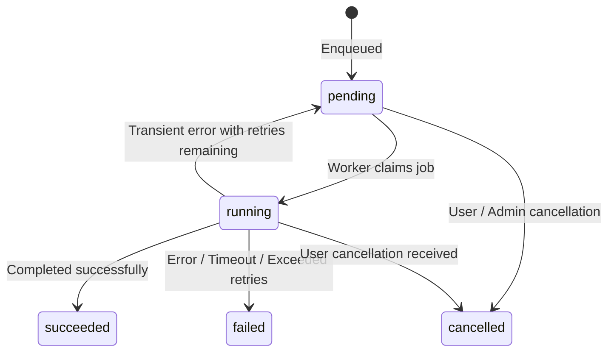

# jobs.md – Asynchronous Job Execution & Worker Queue Contract

## 1. Overview
Laporin uses a PostgreSQL-backed job queue for background asynchronous workloads (AI research crawling and DOCX/PDF generation). On a 2 GB RAM / 16 GB VPS, a lightweight in-process Rust worker pool coordinates tasks directly via PostgreSQL transactions (`FOR UPDATE SKIP LOCKED`).

## 2. Job State Machine
Jobs (`research_jobs` and `generation_jobs`) progress through the following states:



| State       | Description |
|-------------|-------------|
| `pending`   | Job created and waiting in PostgreSQL queue to be claimed by a worker. |
| `running`   | Claimed by an active worker thread with updated `started_at` timestamp. |
| `succeeded` | Execution finished with all outputs written to disk and DB. |
| `failed`    | Irrecoverable error occurred, timeout elapsed, or `attempts >= max_attempts`. |
| `cancelled` | Cancelled by user or replaced by newer request. |

## 3. Concurrency Limits & Worker Pool
To prevent resource exhaustion on a 2 GB VPS:
- **Research Worker Pool**: Max **2 concurrent workers**.
- **Generation Worker Pool**: Max **1 concurrent worker** (due to LibreOffice memory spikes ~300 MB).
- **Polling Interval**: Workers poll `pending` jobs every **2 seconds** using `SELECT ... FOR UPDATE SKIP LOCKED`.

## 4. Timeouts, Retries & Back-off
| Job Type    | Hard Timeout | Max Attempts | Back-off Strategy |
|-------------|--------------|--------------|-------------------|
| Research    | 10 minutes   | 3            | Exponential: 30s, 120s, 300s |
| Generation  | 5 minutes    | 3            | Exponential: 15s, 60s, 180s  |

- If a transient network or provider failure occurs:
  - If `attempts < max_attempts`: job state is returned to `pending` with `scheduled_at = now() + backoff_delay`.
  - If `attempts >= max_attempts`: job transitions to `failed`, setting `error_code='MAX_RETRIES_EXCEEDED'` and `error_message`.
- Corresponding `report_projects.status` transitions to `failed` upon permanent job failure.

## 5. Duplicate Job Prevention
- A report can have **at most one active job** (status in `pending` or `running`) at any time.
- Enqueue endpoints (`POST /reports/{id}/research/start` and `POST /reports/{id}/generation/start`) verify via atomic transaction:
  ```sql
  SELECT id FROM research_jobs 
  WHERE report_id = $1 AND status IN ('pending', 'running');
  ```
- If an active job exists, the endpoint returns `409 Conflict` (`code: 'JOB_ALREADY_ACTIVE'`).

## 6. Stale Job Detection & Crash Recovery
- **Heartbeat / Timeout Monitor**: A supervisor loop runs every **60 seconds**.
- **Stale Detection**:
  - Any job in `running` status whose `started_at` is older than `timeout + 5 minutes` is considered orphaned (e.g. process crash or killed by OS OOM killer).
- **Crash Recovery Action**:
  - If `attempts < max_attempts`, increment `attempts`, reset state to `pending`, and log warning.
  - If `attempts >= max_attempts`, mark state as `failed` with `error_code='WORKER_CRASHED_OR_TIMEOUT'`.

## 7. Low-Memory Guard (2 GB RAM Safety)
- Workers check available system memory (`/proc/meminfo` or `sysinfo`) before claiming a new job from the queue.
- **Threshold**: If available system RAM is **< 500 MiB**:
  1. Worker **pauses job claiming** for 10 seconds.
  2. Runs garbage collection / drops idle connections.
  3. Emits a structured log alert `WARN: low_memory_pressure_job_paused`.
  4. Resumes job claiming only once available memory exceeds 500 MiB.
